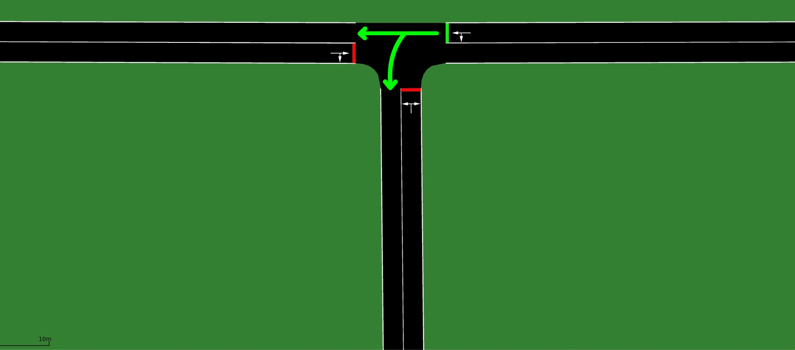
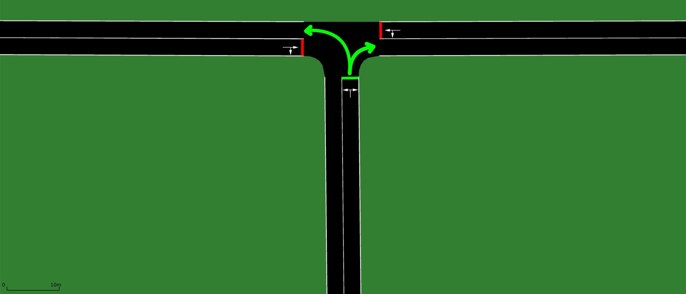
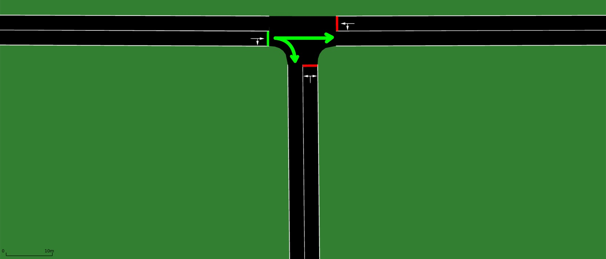
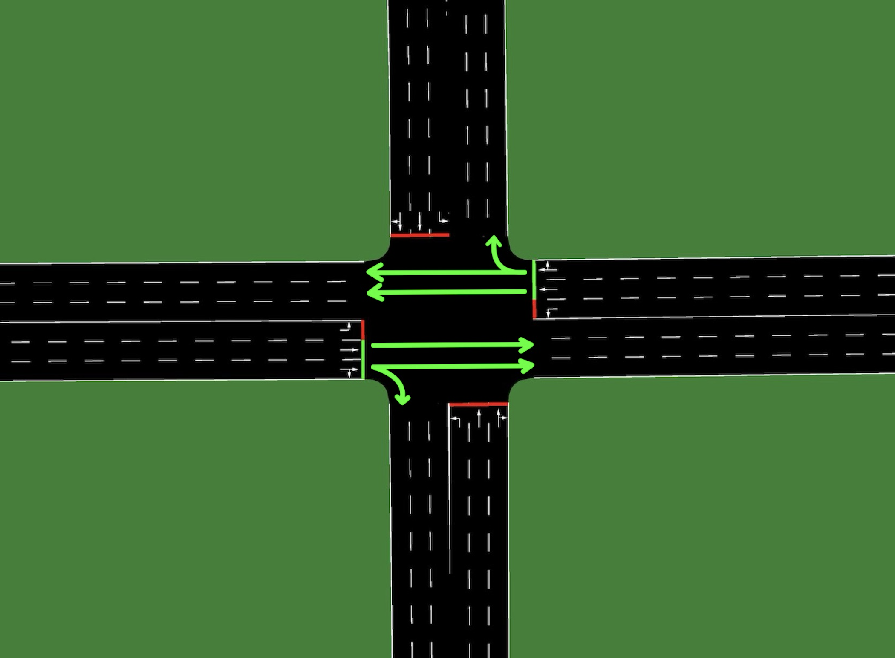
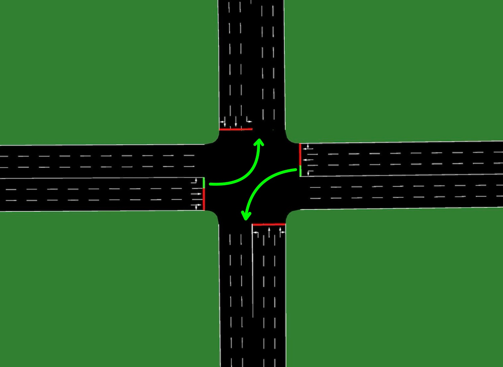
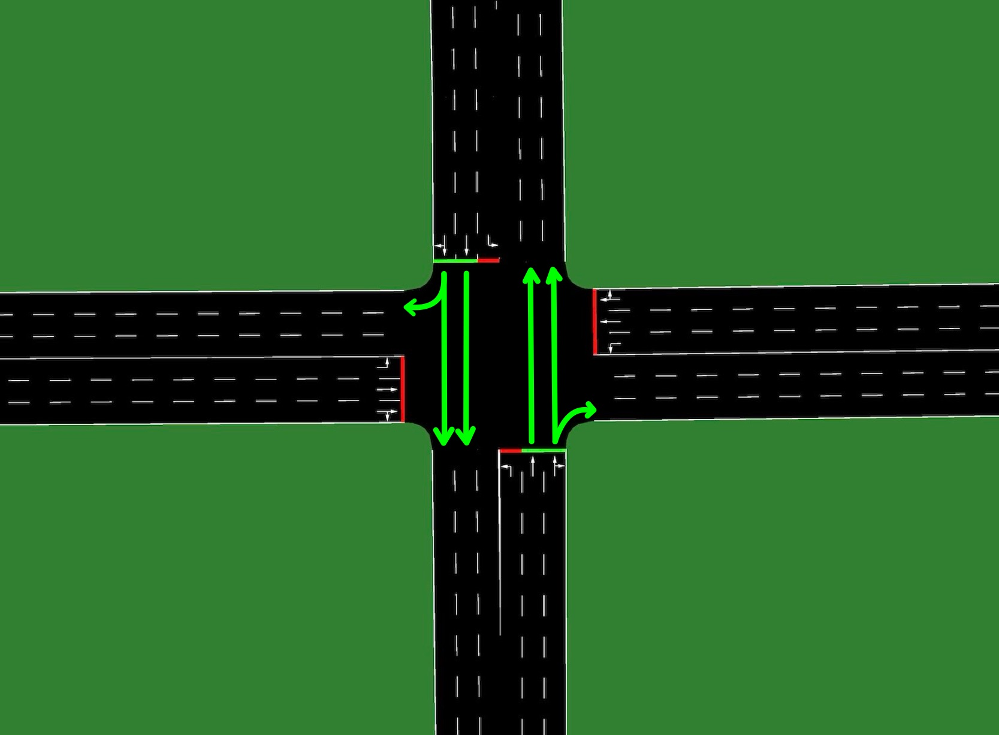
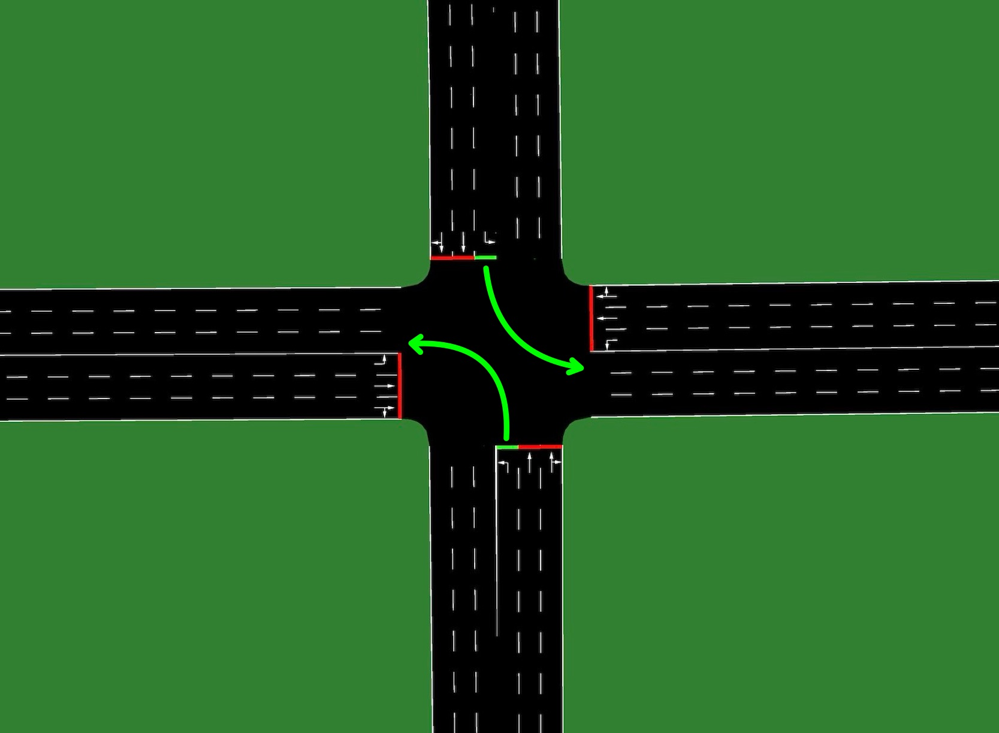

# Adaptive Urban Traffic Control with Reinforcement Learning

This repository contains the implementation and simulation experiments of **adaptive traffic signal control** using **Reinforcement Learning (RL)** and **Deep Reinforcement Learning (Deep RL)**.

The project investigates how RL-based controllers can outperform traditional **fixed-time traffic light schedules**, first in a simplified intersection and then in a more complex and realistic environment. All experiments are conducted using **SUMO (Simulation of Urban Mobility)** and Python.

---

## Overview

Urban traffic congestion is a growing challenge in modern cities. Traditional traffic lights operate using **fixed-time schedules** calibrated on historical data. These systems:

- Cannot adapt to real-time traffic fluctuations  
- Cause unnecessary waiting times  
- Increase fuel consumption and emissions  
- Struggle under highly dynamic traffic patterns  

This project formulates traffic light control as a **sequential decision-making problem** using Reinforcement Learning.

---

## Reinforcement Learning Formulation

Traffic control is modeled as a **Markov Decision Process (MDP)**:

- **Agent** → Traffic light controller  
- **Environment** → SUMO traffic simulation  
- **State** →  
  - Queue lengths on incoming lanes  
  - Current traffic light phase  
- **Action** →  
  - Keep current green phase  
  - Switch to another allowed green phase  
- **Reward** →  
  - Negative total queue length  
  - Encourages congestion minimization  

The objective is to learn policies that **minimize queue lengths and maximize traffic efficiency**.

---

## Repository Structure

The repository currently consists of two main Jupyter notebooks:

### `SimpleTraci_FQ.ipynb`
- Simulates a **three-way intersection**
- Compares:
  - Fixed-Time controller
  - Tabular Q-learning agent
- Demonstrates that classical RL can outperform static schedules in low-dimensional environments

### `Traci_QD.ipynb`
- Simulates a **four-way intersection**
- Compares:
  - Tabular Q-learning
  - Deep Q-learning (DQN)
- Shows:
  - Scalability limitations of tabular Q-learning
  - Advantages of function approximation using neural networks

> All RL logic (state representation, reward computation, epsilon decay, Q-table updates, DQN training with replay buffer and target network) is implemented directly inside the notebooks.

---

## Simulation Files

The `sumo/` directory contains the full SUMO configuration used for the experiments.

For each scenario (three-way and four-way intersection), it includes:

- Simulation configuration files (`.sumocfg`)
- Network definition files (`.net.xml`)
- Traffic flow definitions (`.rou.xml`)
- Detector configuration files (`.add.xml`)
- Additional network construction files (nodes, edges, connections, traffic light logic)

These files allow full reproducibility of the simulation environment used in the notebooks.

To manually launch a scenario:
```bash
sumo-gui -c sumo/simple/SimpleTraci.sumocfg
```
---
## Intersection Layouts

### Traffic Signal Phases (Three-Way Intersection)

<table align="center" width="100%" cellspacing="0" cellpadding="0">
  <tr>
    <td align="center" width="50%">
      
    </td>
    <td align="center" width="50%">
      
    </td>
  </tr>
  <tr>
    <td colspan="2" align="center">
      
    </td>
  </tr>
</table>

### Traffic Signal Phases (Four-Way Intersection)

<table align="center" width="100%" cellspacing="0" cellpadding="0">
  <tr>
    <td align="center" width="50%">
      
    </td>
    <td align="center" width="50%">
      
    </td>
  </tr>
  <tr>
    <td align="center" width="50%">
      
    </td>
    <td align="center" width="50%">
      
    </td>
  </tr>
</table>

## Algorithms Implemented

### Fixed-Time Controller
- Predefined green and yellow phase durations
- No adaptation to traffic conditions

### Q-learning (Tabular)
- Epsilon-greedy exploration with cosine decay
- Q-table update rule:
```text
Q(s,a) = Q(s,a) + α ( r + γ max_a' Q(s',a') - Q(s,a) )
```

- Minimum green time constraint to prevent unrealistic switching

### Deep Q-Network (DQN)
- Neural network approximates Q-function
- Replay buffer for experience reuse
- Target network for stability
- Batch training
- Training frequency and target update frequency

---

## Experimental Results (Summary)

### Three-Way Intersection

| Method        | Average Queue Length |
|--------------|----------------------|
| Fixed-Time   | ≈ 2.60               |
| Q-learning   | ≈ 1.31               |

✔ Q-learning learns an adaptive policy that significantly reduces congestion.

---

### Four-Way Intersection

| Method              | Average Queue Length |
|--------------------|----------------------|
| Q-learning         | ≈ 4.31               |
| Deep Q-learning    | ≈ 2.11               |

✔ Tabular Q-learning fails to scale due to state-space explosion.  
✔ Deep Q-learning successfully generalizes across a high-dimensional state space.

## Limitations

- Single-intersection environments only
- No pedestrian modeling

## License

This project is licensed under the MIT License.


